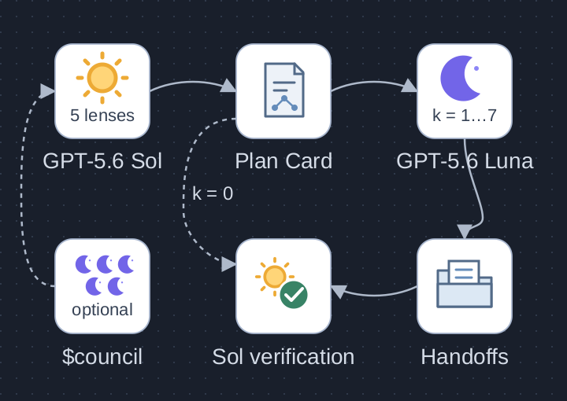
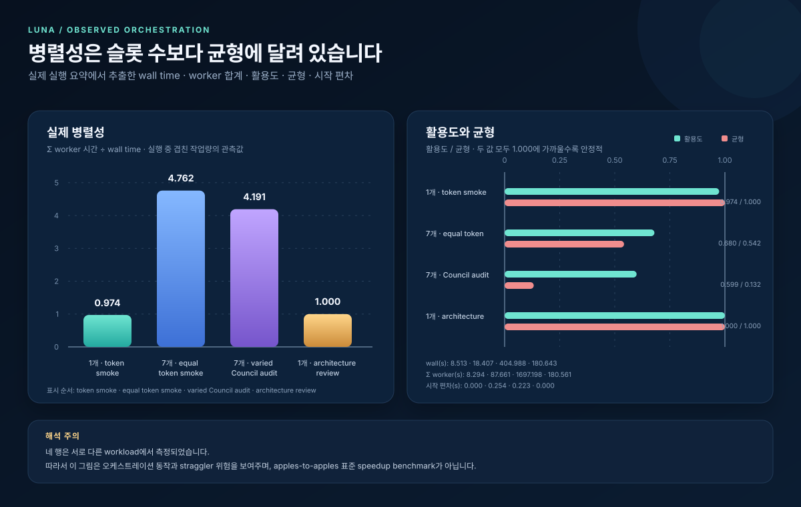

# luna-team-build



[Editable SVG](assets/architecture.svg) · [Artwork and contract provenance](assets/architecture-provenance.md)

Sol's five Council views are **in-thread planning lenses**. Sol freezes the Plan Card, selects **k = 0..7 total Luna task sessions**, and verifies the combined result. With k=0, Sol completes the work directly. For schema v2, the simultaneous-active `concurrency_limit` is separate from k. A failed predecessor skips its descendants; unrelated branches continue. The dashed full `$council` branch is optional and requires an explicit invocation. Sun and moon symbols are original conceptual artwork.

GPT-5.6 Sol을 루트 지휘자로 두고, 필요할 때만 GPT-5.6 Luna 작업자를 병렬로 실행하는 Codex Skill입니다. 복잡한 코딩·리팩터링·데이터·UI·검증 작업을 작은 단위로 나누고, 계약을 고정한 뒤 결과를 다시 루트에서 통합하고 검증합니다.

이 프로젝트는 OpenAI의 공식 제품, 보증, 추천 또는 후원 프로젝트가 아닙니다. 모델 이름과 기능 제공 여부는 계정·지역·제품 버전에 따라 달라질 수 있습니다.



> **벤치마크 해석 주의:** 아래 네 측정은 서로 다른 작업 부하입니다. 따라서 수치는 표준화된 속도 향상 비교가 아니라, 오케스트레이션의 겹침·유휴 슬롯·straggler 위험을 보여주는 관측값입니다.

## 무엇을 하는가

사용자가 프롬프트에서 $luna-team-build를 명시적으로 호출하면 다음 흐름을 따릅니다.

### 호출 방식과 Council 범위

| 사용자 호출 | 계획 과정 | 권장 상황 |
|---|---|---|
| `$luna-team-build` | Sol이 다섯 Council 관점을 짧은 in-thread planning lenses로 적용한 뒤 k와 scheduler를 고릅니다. 별도 Council 자문 세션 5개는 시작하지 않습니다. | 대부분의 구현·리팩터링·검증 작업에 권장하는 기본 경로 |
| `$council $luna-team-build` | 독립적인 Luna 자문위원 5명과 Sol 종합을 먼저 수행한 뒤, 그 결론으로 Team Build Plan Card와 실행 일정을 확정합니다. | 아키텍처 선택, 되돌리기 어려운 변경, 실패 비용이 큰 결정 |
| `$council` | 독립적인 Luna 자문위원 5명과 Sol 종합으로 의사결정을 지원하며, Team Build 작업자 실행은 자동으로 포함하지 않습니다. | 구현보다 비교·검토·의사결정 자체가 목적일 때 |

manifest의 `plan.council_used: true`는 다섯 planning lens가 Plan Card에 기록됐다는 감사 표식입니다. 별도 `$council` Skill의 외부 자문 세션 5개가 실제로 실행됐다는 뜻은 아닙니다. full Council은 계획 강건성을 높이는 대신 다섯 세션의 시작·응답·종합 시간이 추가되므로, 매번 실행하는 것이 latency 측면에서 더 효율적인 것은 아닙니다.

1. **Sol 사전 점검:** 요청, 저장소 지침, 현재 상태, 관련 파일과 검증 명령을 읽습니다.
2. **Council 계획:** Strategist, Skeptic, Creative, Operator, Audience Advocate의 다섯 관점을 Sol의 짧은 in-thread planning lenses로 적용해 Plan Card를 만듭니다. `$luna-team-build`를 로드한다고 다섯 개의 full Council subagent가 실행되는 것은 아닙니다. full `$council`은 사용자가 명시적으로 호출하거나 별도로 문서화된 high-risk gate가 요구할 때만 실행합니다.
3. **계약과 소유권 고정:** 작업 항목, 정적 의존성 DAG, 정확한 파일 소유권, named handoff artifact/contract, 수락 기준, 검증 명령을 고정합니다.
4. **Luna 실행:** 독립적이고 의미 있는 트랙만 GPT-5.6 Luna 세션으로 보냅니다. 각 세션은 codex exec로 실행되는 격리 프로세스이며, 같은 파일시스템을 공유합니다.
5. **루트 통합과 검증:** Sol이 작업자 결과와 변경을 확인하고, 계약을 조정하고, 전체 검증을 한 번 수행한 뒤 최종 결과를 보고합니다. 실패한 predecessor의 descendants는 skipped로 남기되 unrelated branch는 계속 검증합니다.

모든 Luna 작업자의 유효 실행 계약은 다음과 같습니다.

- 모델: gpt-5.6-luna
- 추론: max
- 서비스 계층: fast
- 승인 정책: never
- 샌드박스: danger-full-access
- 중첩 다중 에이전트 위임: 비활성화

danger-full-access는 실행 권한일 뿐이며, 사용자가 요청하지 않은 작업을 수행할 권한을 추가하지 않습니다.

## 스케줄러 계약과 자동 선택

사용자는 목표와 제약만 제시하면 됩니다. Sol이 정적 작업 그래프와 예상 end-to-end 시간을 보고 schema와 scheduler fields를 자동으로 결정하므로, 사용자가 `scheduler_mode`나 `concurrency_limit`을 직접 조정할 필요가 없습니다.

| 계약 | 의미 |
|---|---|
| schema v1 | 기존/current 기본값. 독립적인 one-ready-wave만 허용하며 non-empty `depends_on`을 거부합니다. `selected_worker_count`는 `workers` entries와 같은 전체 task/session 수(0..7)입니다. |
| schema v2 | manifest에서 opt-in. `plan.scheduler_mode`가 `rolling-dag-v1` 또는 `barrier-dag-v1`이어야 하고 `plan.concurrency_limit`도 필수입니다. 전체 선택 task 수와 동시에 active인 수를 분리합니다. |

schema v2에서 `selected_worker_count`는 `workers` entries와 같은 DAG의 전체 선택 task/session 수(계속 0..7)이고, `concurrency_limit`은 한 시점에 동시에 active할 수 있는 최대 task 수입니다. 따라서 task 4개와 cap 2는 4개 세션을 선택하지만 한 번에 최대 2개만 실행한다는 뜻입니다. v2의 task와 dependency edge는 시작 전에 모두 고정합니다.

자동 선택 규칙은 다음과 같습니다.

- 독립적인 ready wave 하나면 schema v1을 선택합니다. 이것이 기본 경로입니다.
- frozen static DAG에 straggler가 실행 중일 때 곧 unlock될 queued work가 있으면 schema v2 `rolling-dag-v1`을 선택합니다. 성공 이벤트 즉시 successor를 unlock합니다.
- schema v2 `barrier-dag-v1`은 A/B benchmark 또는 명시적으로 문서화된 compatibility investigation에서만 선택합니다. 일반 실행의 기본값이 아닙니다.
- ready task는 critical-path-first로 정렬합니다. predecessor 실패 시 descendants는 skipped로 표시하고 unrelated branch는 계속 진행합니다.

모든 task와 root path의 write ownership은 전역적으로 서로 겹치지 않아야 합니다. handoff는 이름 있는 파일 artifact와 contract를 가리키고, Sol은 항상 combined verification을 수행합니다. 이번 revision의 범위에는 dynamic replanning, runtime-created tasks, retries, speculative writes, checkpoint/resume, cancellation semantics가 포함되지 않습니다.

### Schema v2 예시

다음은 `spec` 이후 `api`와 `ui`가 갈라지고 `integration`에서 합쳐지는 실제 DAG입니다. 초기 ready task는 1개, 전체 선택 task는 4개, 동시성 상한은 2개이며 `spec -> api -> integration`이 critical path입니다.
아래 JSON은 scheduler/DAG 핵심만 보인 축약 예시입니다. 실제 manifest에는 기존 worker의 prompt, working directory, estimate, acceptance, verification과 전체 candidate schedule 필드도 포함해야 합니다.

```json
{
  "schema_version": 2,
  "plan": {
    "scheduler_mode": "rolling-dag-v1",
    "concurrency_limit": 2,
    "selected_worker_count": 4,
    "ready_track_count": 1
  },
  "workers": [
    {"name": "spec", "depends_on": [], "owned_paths": ["contracts/api.json"]},
    {"name": "api", "depends_on": ["spec"], "owned_paths": ["server.py"]},
    {"name": "ui", "depends_on": ["spec"], "owned_paths": ["web"]},
    {"name": "integration", "depends_on": ["api", "ui"], "owned_paths": ["tests/integration"]}
  ]
}
```

schema v1 manifest는 그대로 실행됩니다. v1-only consumer가 v2를 만나면 dependency edge나 scheduler mode를 버리고 실행해서는 안 되며, 명확히 거부해야 합니다. v1로 내릴 때는 dependency를 삭제해 flatten하지 말고 모든 task가 정말 독립적인지 먼저 증명해야 합니다.

## 실행 모델: k = 0부터 k = 7까지

여기서 k는 **선택한 Luna task/session의 총수**입니다. v2에서 동시에 실행되는 수는 별도의 `concurrency_limit`입니다. 전체 모델 수가 아닙니다. Sol은 항상 루트이며, k=0은 Luna를 시작하지 않고 Sol이 처음부터 끝까지 처리하는 root-only 모드입니다.

| k | 구성 | 적합한 상황 |
|---:|---|---|
| 0 | Sol만 실행 | 짧은 작업, 하나의 지배적인 파일, 강하게 결합된 연쇄 작업 |
| 1 | Sol + Luna 1개 | 독립 트랙 하나가 있고 작업자 시작 비용을 감수할 가치가 있을 때 |
| 2 | Sol + Luna 2개 | 백엔드와 프런트엔드처럼 두 개의 명확한 소유 영역이 있을 때 |
| 3 | Sol + Luna 3개 | 세 개의 준비된 구현·검증 트랙이 실제로 독립적일 때 |
| 4 | Sol + Luna 4개 | 네 task로 된 고정 DAG 또는 충분한 독립 작업량이 있을 때 |
| 5 | Sol + Luna 5개 | 다섯 개의 실질적인 selected task가 있을 때 |
| 6 | Sol + Luna 6개 | 여섯 개를 채우기 위한 분할이 아니라, 여섯 개의 가치 있는 task가 있을 때 |
| 7 | Sol + Luna 7개 | 일곱 task 모두가 준비되고 더 작은 팀보다 end-to-end 시간이 실제로 짧을 때 |

7은 **hard ceiling이지 목표값이 아닙니다**. 작은 작업을 억지로 나눠 parallelism_ratio를 높이거나, 문서·종속 테스트만을 위해 task를 추가하지 않습니다. 판단 기준은 다음과 같은 사용자 체감 경로입니다.

전체 시간 = 계획 및 계약 고정 + v1의 가장 느린 ready worker 또는 v2의 DAG scheduler wall + 숨길 수 없는 Sol 작업 + 시작·충돌·재작업 비용 + 통합·최종 검증

작업자 수가 늘어도 한 작업자의 추론이 빨라지는 것은 아닙니다. 특히 길이가 다른 Council 감사 트랙에서는 느린 작업자 하나가 전체 벽시계 시간을 지배하고 balance와 utilization을 낮출 수 있습니다.

다중 에이전트가 더 느려지는 대표적인 경우는 다음과 같습니다.

- task가 너무 작아 Luna 시작·handoff 비용이 실제 작업보다 큰 경우
- shared mutable state 때문에 충돌, lock, 재작업이 생기는 경우
- 순서가 긴 chain이라 동시에 ready인 일이 없는 경우
- integration과 최종 검증이 대부분을 차지하는 경우
- model/session startup overhead가 작업 시간보다 큰 경우

따라서 k=0은 실패한 launch가 아니라 정식 결과입니다. Sol은 다섯 planning lens를 기록한 뒤에도 root-only가 가장 짧고 검증 가능한 경로면 k=0을 선택합니다.

## Sol · Council · Luna 구조

~~~mermaid
flowchart TD
    U["사용자 요청<br/>명시적 $luna-team-build"] --> S["GPT-5.6 Sol · max<br/>루트 지휘자"]
    S --> C["Planning Council<br/>Strategist · Skeptic · Creative<br/>Operator · Audience Advocate"]
    C --> P["Plan Card<br/>계약 · DAG · 후보 k · 검증"]
    P -. "k = 0: Luna 없이 Sol 직행" .-> I["Sol 통합 및 최종 검증"]
    P --> R{"준비된 독립 트랙"}
    R --> L1["GPT-5.6 Luna · max<br/>Worker 1"]
    R --> L2["GPT-5.6 Luna · max<br/>Worker 2"]
    R --> L3["GPT-5.6 Luna · max<br/>Worker 3"]
    R -. "필요할 때만, k ≤ 7" .-> L7["GPT-5.6 Luna · max<br/>Worker 7"]
    L1 --> A["상태·결과·요약 아티팩트"]
    L2 --> A
    L3 --> A
    L7 --> A
    A --> I
    I --> V["결합 테스트 및 사용자 보고"]
~~~

Council의 다섯 이름은 계획 관점입니다. 실제로 별도 Luna 세션을 다섯 개 실행했다는 뜻이 아닙니다. Luna 작업자는 native spawn_agent 자식이 아니라, Windows에서 실행되는 독립 codex exec 세션이며, 결과 아티팩트와 공유 파일시스템을 통해 조정됩니다.

## 사전 요구 사항

- Codex CLI가 설치되어 있고 codex가 PowerShell의 PATH에서 실행되어야 합니다.
- 계정 또는 조직에서 gpt-5.6-sol과 gpt-5.6-luna를 사용할 수 있어야 합니다. 시작 전에 현재 런타임 모델 식별자를 다시 확인하세요.
- Windows PowerShell 실행 환경이 필요합니다. 기본 런너는 scripts/run-luna-team.ps1입니다.
- 작업 저장소, 모델 사용량, 네트워크·디스크 상태를 확인할 수 있는 권한이 필요합니다.
- k=1..7 실행에서는 여러 세션이 같은 파일시스템을 공유하므로, 작업 범위와 파일 소유권을 정확히 나눌 수 있어야 합니다.

## 설치

### 권장: $skill-installer

Codex에서 다음을 실행합니다.

~~~text
$skill-installer install the skill from https://github.com/Kimhyuntae9665/codex-skill-luna-team-build/tree/main/skills/luna-team-build
~~~

설치 후 Codex를 다시 시작해야 새 Skill을 인식합니다. 저장소의 `skills/luna-team-build` 경로가 설치 가능한 Skill 루트입니다.

### 수동 설치

저장소를 내려받은 뒤 PowerShell에서 저장소 루트에 들어가 다음을 실행합니다.

~~~powershell
$repo = (Get-Location).Path
$skillSource = Join-Path $repo 'skills\luna-team-build'
$codexHome = if ([string]::IsNullOrWhiteSpace($env:CODEX_HOME)) {
    Join-Path $env:USERPROFILE '.codex'
} else {
    $env:CODEX_HOME
}
$destination = Join-Path $codexHome 'skills\luna-team-build'
New-Item -ItemType Directory -Force -Path $destination | Out-Null
Copy-Item -Path (Join-Path $skillSource '*') -Destination $destination -Recurse -Force
~~~

CODEX_HOME을 따로 쓰는 환경에서는 그 경로를 유지하세요. 복사 후 Codex를 다시 시작하고 Skill 목록에서 luna-team-build를 확인합니다.

## 사용법

### 명시적 호출 예시

Skill은 자동으로 모든 작업에 적용되지 않습니다. Codex 대화에서 다음처럼 명시적으로 호출합니다.

~~~text
$luna-team-build

C:\work\sample-app의 결제 모듈을 리팩터링해 주세요.
API 계약과 데이터 마이그레이션은 먼저 고정하고, 독립적인 파일 소유권으로 나눠 구현한 뒤
루트에서 전체 테스트와 변경 요약을 검증해 주세요. 실제 배포는 하지 마세요.
~~~

Sol은 작업량과 의존성을 보고 k=0..7 후보를 비교합니다. 사용자가 k=7을 지정한다고 해서 일곱 작업자를 무조건 실행하는 것이 아니라, 계약과 ready track 조건을 충족하는지 먼저 확인해야 합니다.

### 런너를 직접 호출하는 고급 경로

정형 manifest를 이미 준비한 경우에만 Windows PowerShell 런너를 직접 호출할 수 있습니다. manifest에는 정확한 절대 작업 디렉터리, 비중첩 owned_paths, 수락 기준, 검증 명령, Council 메타데이터가 있어야 합니다.

~~~powershell
$runner = Join-Path $env:USERPROFILE '.codex\skills\luna-team-build\scripts\run-luna-team.ps1'
$output = Join-Path $env:TEMP 'luna-team-run'
& $runner -ManifestPath .\manifest.json -OutputDirectory $output
~~~

정상 실행에서는 run-status.json, run-results.json, run-summary.json이 출력 디렉터리에 남습니다. 두 개 이상 작업자를 실행할 때는 detached 모드와 짧은 상태 폴링을 사용하되, 부분적으로 쓰이는 파일을 통합하지 마세요.

## 아티팩트와 지표

런너의 요약은 실행 시점의 다음 값을 기록합니다.

| 지표 | 의미 |
|---|---|
| wall | 루트가 작업자 wave를 시작해 완료할 때까지의 실제 경과 시간(초) |
| summed worker | 모든 작업자 duration_seconds의 합(초) |
| parallelism ratio | summed worker / wall; 실제 시간 겹침의 관측값 |
| utilization | v1: summed worker / (k × wall); v2: summed active task time / (`concurrency_limit` × wall) |
| balance | min(worker duration) / max(worker duration); 작업자 길이 균형 |
| start skew | 가장 늦은 작업자 시작 시각과 가장 이른 시작 시각의 차이(초) |
| task count | 전체 선택 task/session 수; `selected_worker_count`와 같고 0..7 |
| concurrency cap | v2의 `plan.concurrency_limit`; 동시에 active인 최대 task 수 |
| initial-ready count | 시작 시점에 dependency가 충족된 task 수 |
| critical path | frozen DAG의 ordered task IDs 및 `critical_path_seconds` 예측 경로 |
| peak active workers | 실제로 동시에 active였던 최대 task 수 |
| queue wait | eligible 상태에서 active가 되기 전까지 기다린 시간 |
| skipped/failure states | predecessor 실패로 skipped된 task와 실제 failed task의 ID·상태 |
| predicted vs actual wall | 사전 예측 wall과 `wall_duration_seconds` 실제 측정 wall의 나란한 값 |
| utilization / idle-slot seconds | `actual_capacity_utilization`과 `idle_slot_seconds`; cap 아래에서 사용되지 않은 slot 시간 |

기록된 관측값은 다음과 같습니다. 소수점 세 자리는 원본 요약의 표시 정밀도를 그대로 보존합니다.

| workload | k | wall | summed worker | parallelism | utilization | balance | start skew |
|---|---:|---:|---:|---:|---:|---:|---:|
| one-worker token smoke | 1 | 8.513 | 8.294 | 0.974 | 0.974 | 1.000 | 0.000 |
| seven-worker equal token smoke | 7 | 18.407 | 87.661 | 4.762 | 0.680 | 0.542 | 0.254 |
| seven-worker varied Council audit | 7 | 404.988 | 1697.198 | 4.191 | 0.599 | 0.132 | 0.223 |
| one-worker architecture review | 1 | 180.643 | 180.561 | 1.000 | 1.000 | 1.000 | 0.000 |

전체 표와 측정 방법은 [benchmark-data.csv](docs/benchmark-data.csv)와 [benchmark-methodology.md](docs/benchmark-methodology.md)에 있습니다. 시각화는 [efficiency-benchmark.svg](assets/efficiency-benchmark.svg)입니다.

이 값들은 서로 다른 workload에서 수집되었습니다. seven-worker varied Council audit의 낮은 balance와 utilization은 실제 straggler 위험을 잘 보여주지만, one-worker token smoke 또는 다른 한 행과의 표준화된 속도 향상으로 읽을 수 없습니다. 같은 입력·동일한 작업량·동일한 환경을 고정한 apples-to-apples speedup benchmark가 아닙니다.

새 scheduler 비교에는 [benchmark-methodology.md](docs/benchmark-methodology.md)의 paired protocol을 사용합니다. 같은 prompt, model/runtime, repository commit, frozen task DAG, `concurrency_limit`, acceptance tests를 고정하고 `barrier-dag-v1`과 `rolling-dag-v1`만 바꿉니다. 최소 한 번의 warm-up은 버리고 같은 조건의 반복 trial을 수행한 뒤 median과 p95 wall을 보고합니다. correctness, peak concurrency, dependency ordering, queue wait, utilization, idle-slot seconds도 함께 기록하고 token/rate-limit 영향과 rework를 별도로 표시합니다. 현재의 historical rows에는 새 결과를 섞거나 comparable한 것처럼 덮어쓰지 않습니다. 이번 deterministic 5-pair와 live 1-pair 결과·한계는 [scheduler-benchmark-results.md](docs/scheduler-benchmark-results.md)에 분리했습니다.

### k=0 전방 검증

2026-08-09에 새 Codex 세션에서 README 한 파일을 읽는 실제 요청으로 Skill을 명시 호출했습니다. Council 추정치는 계획 6초를 공통으로 포함해 `k=0` 총 15초, `k=1` 총 31초였고, 더 작은 `k=0`을 선택했습니다. 검증 디렉터리에는 `run-manifest.json`과 `run-status.json`만 생성됐으며, 이벤트의 실행 명령에는 `gpt-5.6-luna`를 사용하는 `codex exec`가 없었습니다.

| 후보 | worker wall | coordination | root serial | 검증 | 계획 포함 총계 |
|---:|---:|---:|---:|---:|---:|
| k=0 | 0초 | 0초 | 6초 | 3초 | 15초 |
| k=1 | 15초 | 3초 | 2초 | 5초 | 31초 |

이 표는 해당 Council의 사전 추정값이며 실측 속도 벤치마크가 아닙니다. 목적은 짧고 결합된 작업에서 Luna 시작·전달·종합 비용을 후보 계산에 포함해 root-only가 실제로 선택되는지 확인하는 것입니다.

## 안전 경고

danger-full-access와 approval_policy=never 조합은 작업자 프로세스가 승인 대기 없이 넓은 파일시스템·셸 권한으로 실행될 수 있음을 뜻합니다.

- 신뢰할 수 있는 로컬 저장소와 격리된 테스트 환경에서만 사용하세요.
- API 키, SSH 키, 개인 문서, 프로덕션 자격 증명을 작업 디렉터리와 세션 환경에서 제거하거나 보호하세요.
- 작업자 manifest의 owned_paths를 최소화하고, 다른 작업자의 변경을 되돌리지 마세요.
- 공유 파일시스템에서는 같은 파일을 두 작업자에게 배정하지 마세요. 작업자 완료 후 부분 파일이 아니라 최종 handoff와 결과 파일을 확인하세요.
- 실제 배포, 데이터 삭제, 외부 메시지, 구매, 비행 또는 기타 외부 상태 변경은 별도 명시 요청과 독립적인 확인 없이는 수행하지 마세요.

샌드박스가 넓어져도 사용자의 승인 범위나 작업자의 bounded assignment가 넓어지는 것은 아닙니다.

## 알려진 한계

- GPT-5.6 Sol/Luna의 가용성, 모델 식별자, 사용량 한도, 서비스 계층은 환경에 따라 다릅니다. 설치 성공만으로 런타임 성공을 보장하지 않습니다.
- Windows PowerShell 런너는 한 Windows 세션에서 하나의 live positive scheduler run만 허용하며, 선택 task/session은 최대 7개입니다. v2의 동시 active 수는 `concurrency_limit`으로 제한됩니다.
- 작업자는 별도 Git worktree가 아니라 같은 파일시스템을 공유합니다. 충돌 방지는 런너의 정확한 소유권·계약 검사와 루트의 최종 검증에 의존합니다.
- schema v2는 frozen static DAG만 다루며 dynamic replanning, runtime-created tasks, retries, speculative writes, checkpoint/resume, cancellation semantics를 제공하지 않습니다.
- Council Plan Card는 계획 기록이지 정답이나 테스트 통과의 증명이 아닙니다. 작업자별 검증과 루트의 결합 검증이 모두 필요합니다.
- 프로세스 시작 비용, 파일 I/O, 네트워크, rate limit, 모델 응답 길이, 작업자 간 불균형이 벽시계 시간을 바꿀 수 있습니다.
- 이 저장소의 벤치마크 네 행은 workload가 다르므로, 성능 약속이나 표준 speedup 수치로 사용할 수 없습니다.

## 공개 저장소 레이아웃

루트 통합 후 공개 저장소는 다음 구조를 가집니다.

~~~text
.
├── skills/
│   └── luna-team-build/
│       ├── SKILL.md
│       ├── agents/
│       │   └── openai.yaml
│       ├── scripts/
│       │   └── run-luna-team.ps1
│       └── references/
│           └── planning-council.md
├── assets/
│   ├── architecture.svg
│   ├── architecture.png
│   ├── architecture-provenance.md
│   └── efficiency-benchmark.svg
├── docs/
│   ├── benchmark-data.csv
│   └── benchmark-methodology.md
├── tests/
│   └── validate-runner.ps1
├── README.md
├── LICENSE
└── .gitignore
~~~

설치 가능한 Skill 구현은 `skills/luna-team-build` 아래에만 두고, 사람을 위한 저장소 문서는 README·assets·docs·LICENSE로 분리합니다. 따라서 `$skill-installer`가 README와 벤치마크 자료를 실행 Skill 폴더에 섞지 않습니다. 로컬 Temp 실행 디렉터리와 비밀값은 저장소에 포함하지 않습니다.

## 검증

최소 검증 순서는 다음과 같습니다.

1. 작업자별 소유 경로 검증과 handoff 확인
2. 루트 통합 후 결합 테스트 및 사용자 수락 기준 확인
3. run-status.json에서 모든 작업자 상태와 run-results.json의 exit code 확인
4. run-summary.json에서 wall, task count, concurrency cap, initial-ready count, critical path, peak active, queue wait, skipped/failure states, utilization, idle-slot seconds 확인
5. SVG XML 파싱, README 내부 상대 링크 확인, CSV 값과 원본 증거 대조
6. `pwsh -NoProfile -File .\tests\validate-runner.ps1`로 k=0, k=1, k=7, legacy 및 거부 경로 회귀 테스트

문서 산출물만 빠르게 확인하려면 저장소 루트에서 다음을 실행할 수 있습니다.

~~~powershell
[xml](Get-Content -Raw .\assets\architecture.svg) | Out-Null
[xml](Get-Content -Raw .\assets\efficiency-benchmark.svg) | Out-Null
Import-Csv .\docs\benchmark-data.csv | Format-Table
~~~

## 참고 문서와 라이선스

- [OpenAI 공식 Build skills 문서](https://learn.chatgpt.com/docs/build-skills)
- [MIT License](LICENSE)

이 저장소의 코드는 MIT License로 배포됩니다. OpenAI와의 제휴·승인·보증을 의미하지 않습니다.
